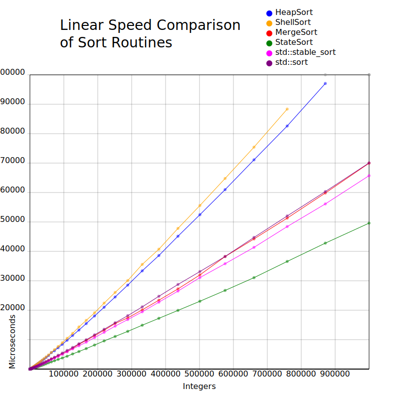
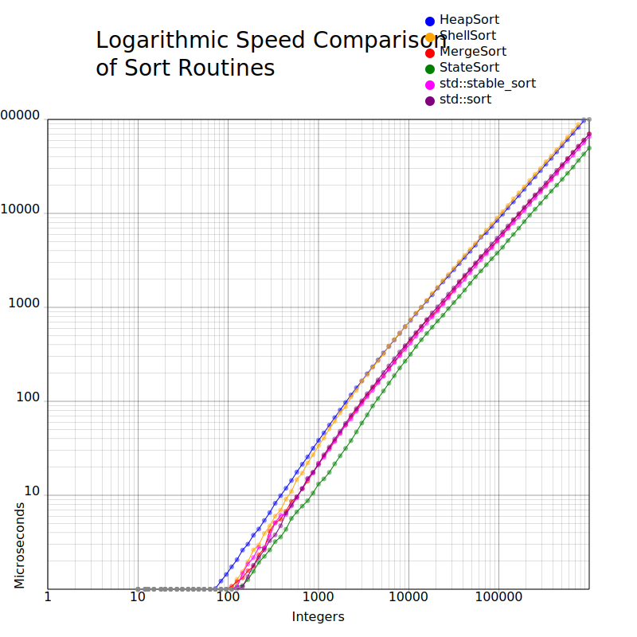

# StateSort

StateSort is a stable comparison sort I have developed that is faster than any comparison sort I have found.

**Faster** than **Windows**, **Linux** and **boost\:\:range** versions of **sort** and **stable_sort**.

You can **test it yourself** easily under Windows or Linux with just the `race.sh` or `race.bat` script, the sub-100 line `race.cpp`, and `StateSort.h` all provided in the `StateSort` folder. Or **send a sort to me**, and I will compare it.

### How It Works

StateSort is a stable hybrid comparison-based sorting algorithm, with O(n log(n)) time complexity and O(n) space complexity.

Like some other modern hybrid sorts, StateSort starts by using InsertionSort to create initial runs of up to, say, 30 elements. It then uses a **<u>simultaneous</u> multiway merging algorithm** to repeatedly combine multiple runs into larger runs, until all elements are sorted.
In the presented version, **four runs are merged simultaneously**. Before merging, the sorted order of all runs by their first element is determined, and this is the merge state. This state is maintained during the merge.

In this implementation, each state can be found after a label; so for example, if the first elements of the runs A through D were ordered C <= D < B < A, the code to handle that state would follow the label "CDBA:".
Each and every state has its own label, which, in the case of a 4-way merge, requires 24 labels. At a state, the least element is appended to a buffer, the run is tested for exhaustion, and if not, the new next element is compared to determine the new state.

Once each run is exhausted, another unique state is entered, for example "BDC:", then "CD:", then "C:".

### Performance On Real World Data

Unlike TimSort and others, this version of StateSort is not adaptive, and so is not designed to perform better on "real world" data. But it seems to do relatively well, as is, against other non-adaptive sorts. An earlier version produced this data:

**Sorts in Microseconds by Data Arrangement, Sort, and Number of Elements**

|                |                  | 95                | 1000               | 95499                 | 1000000                |
|:--------------:| ----------------:| -----------------:| ------------------:| ---------------------:| ----------------------:|
|                |                  |                   |                    |                       |                        |
| **Random**     | MergeSort        | 0.91              | 27.16              | 6,272.40              | 80,049.30              |
|                | std::sort        | 0.80              | 21.87              | 5,498.10              | 70,509.20              |
|                | std::stable_sort | 0.82              | 23.44              | 4,844.80              | 63,666.60              |
|                | StateSort        | <mark>0.48</mark> | <mark>19.95</mark> | <mark>4,420.60</mark> | <mark>57,987.10</mark> |
|                |                  |                   |                    |                       |                        |
| **Ascending**  | MergeSort        | 0.50              | 7.67               | 1,355.38              | 17,988.80              |
|                | std::sort        | 0.31              | 5.44               | 935.09                | 11,433.00              |
|                | std::stable_sort | <mark>0.23</mark> | 2.97               | 475.67                | <mark>6,674.50</mark>  |
|                | StateSort        | 0.25              | <mark>2.82</mark>  | <mark>409.81</mark>   | 6,865.90               |
|                |                  |                   |                    |                       |                        |
| **Descending** | MergeSort        | 0.71              | 11.25              | 1,561.42              | 21,246.80              |
|                | std::sort        | <mark>0.39</mark> | 7.84               | 1,039.13              | 13,841.60              |
|                | std::stable_sort | 0.75              | 8.69               | 1,038.27              | 12,541.80              |
|                | StateSort        | 0.53              | <mark>5.45</mark>  | <mark>634.79</mark>   | <mark>10,399.90</mark> |
|                |                  |                   |                    |                       |                        |
| **Appended**   | MergeSort        | 0.61              | 12.10              | 2,393.80              | 29,980.60              |
| First 80%      | std::sort        | 0.68              | 15.46              | 3,513.80              | 44,262.10              |
| ascending,     | std::stable_sort | 0.36              | 6.05               | 1,320.02              | 17,778.70              |
| then random    | StateSort        | <mark>0.30</mark> | <mark>3.71</mark>  | <mark>1,148.57</mark> | <mark>16,489.40</mark> |

### Testing Hardware

Software was tested on a Windows 10 Pro Version 22H2 PC, with a Ryzen 3400G CPU, and 16 GB RAM.

### Testing Software

Some of the software I used to test speed, stability, generate the graphs, etc., is provided in the `Tests` directory for your review. the IDE is Visual Studio 2022. As can be seen in the test code, efforts were made to compensate for the granularity of timers and for operating system interrupts.

### Observations

**Stability:** Obviously, the stability restriction can be removed to make a faster version. In my limited testing so far, this did not make a huge difference.

**Adaptive Performance:** I have made a few adaptive versions, all of which are much faster when natural sorted runs and reverse runs are found, but are at least somewhat slower on random data. More work is needed.

**Buffer Allocation:** During testing, I noticed that allocating the buffer was sometimes a surprisingly substantial performance hit all by itself, possibly caused by the OS not wanting to allocate uninitialized buffers (seeing this as a security risk) and therefore, initializing buffers to zeros, although I did not investigate this. To address this avoidable delay, I allow the caller to provide their own size N buffer, which I call a loaner buffer. The loaner buffer speedup was not used during any testing shown here.

**Small Sorts:** So far, I have ignored the speed of StateSort for small ( say less than 1000 elements ) sorts. Something can be put in place if StateSort performs poorly on these. As an example, some other modern sorts just defer to std::stable_sort.
