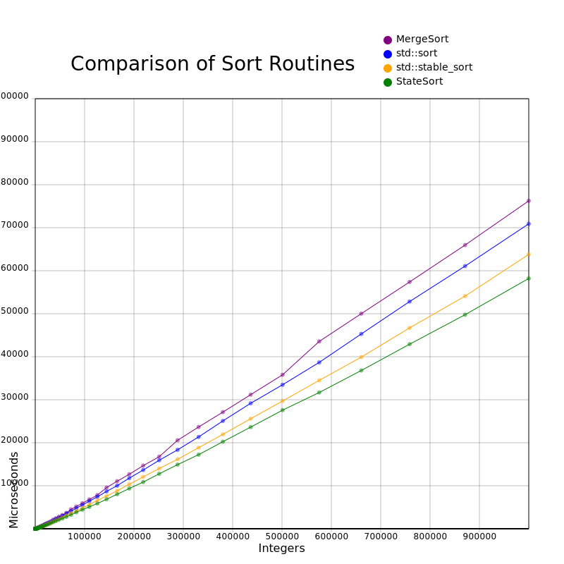
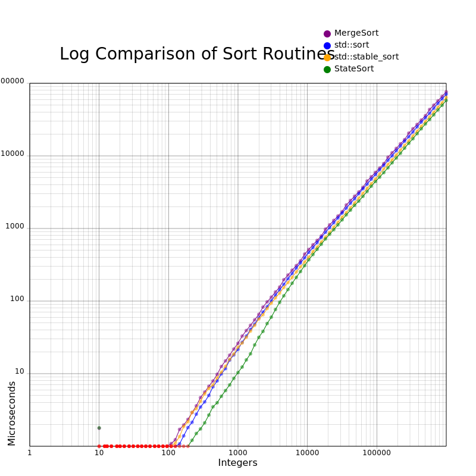

# StateSort

StateSort is a stable hybrid comparison-based sorting algorithm I have developed, with, I believe, O(log(n)) time complexity and O(n) space complexity.

It runs **at least 8% faster than** any stable sort I have tested against, including hybrid **merge/insertion sort, and Windows and Ubuntu std::stable_sort**, at sorting one million random integers. I know this is a bold claim and so I invite your feedback. You can **test it yourself** easily with just `race.sh` or `race.bat`, `StableSortVsStateSort.cpp`, and `StateSort.h` provided in the `race` folder.

### How It Works

Like some other modern hybrid sorts, StateSort starts by using InsertionSort to create initial runs of up to, say, 16 elements. It then uses a K-Way merging algorithm to repeatedly combine multiple runs into larger runs, until all elements are sorted.
In the presented version, five runs are merged at once. Before merging, the sorted order of all runs by their first element is determined, and this is the merge state. This state is maintained during the merge.

In this implementation, each state can be found after a label; so for example, if the first elements of the runs A through E were ordered C <= E < B < A <= D, the code to handle that state would follow the label "CEBAD:".
Each and every state has its own label, which, in the case of a 5-way merge, requires 120 labels. At a state, the least element is appended to a buffer, the run is tested for exhaustion, and if not, the new next element is compared to determine the new state.

Once each list is exhausted, another unique state is entered, for example "CEBD:", "CED:", "CD:", "C:".

### Real World Data

Unlike Timsort and others, this first StateSort was not designed to perform better on "real world" data. Maybe it could/should be? But it seems to do relatively well, as is, against other naive sorts.

**Sorts in Microseconds by Data Arrangement, Sort, and Number of Elements**

|                   |                  | 95                | 1,000              | 95,499                | 1,000,000              |
| ----------------- | ---------------- | -----------------:| ------------------:| ---------------------:| ----------------------:|
|                   |                  |                   |                    |                       |                        |
| **Random**        | MergeSort        | 0.91              | 27.16              | 6,272.40              | 80,049.30              |
|                   | std::sort        | 0.80              | 21.87              | 5,498.10              | 70,509.20              |
|                   | std::stable_sort | 0.82              | 23.44              | 4,844.80              | 63,666.60              |
|                   | StateSort        | <mark>0.48</mark> | <mark>19.95</mark> | <mark>4,420.60</mark> | <mark>57,987.10</mark> |
|                   |                  |                   |                    |                       |                        |
| **Ascending**     | MergeSort        | 0.50              | 7.67               | 1,355.38              | 17,988.80              |
|                   | std::sort        | 0.31              | 5.44               | 935.09                | 11,433.00              |
|                   | std::stable_sort | <mark>0.23</mark> | 2.97               | 475.67                | <mark>6,674.50</mark>  |
|                   | StateSort        | 0.25              | <mark>2.82</mark>  | <mark>409.81</mark>   | 6,865.90               |
|                   |                  |                   |                    |                       |                        |
| **Descending**    | MergeSort        | 0.71              | 11.25              | 1,561.42              | 21,246.80              |
|                   | std::sort        | <mark>0.39</mark> | 7.84               | 1,039.13              | 13,841.60              |
|                   | std::stable_sort | 0.75              | 8.69               | 1,038.27              | 12,541.80              |
|                   | StateSort        | 0.53              | <mark>5.45</mark>  | <mark>634.79</mark>   | <mark>10,399.90</mark> |
|                   |                  |                   |                    |                       |                        |
| **80% Ascending** | MergeSort        | 0.61              | 12.10              | 2,393.80              | 29,980.60              |
| **Followed by**   | std::sort        | 0.68              | 15.46              | 3,513.80              | 44,262.10              |
| **20% Random**    | std::stable_sort | 0.36              | 6.05               | 1,320.02              | 17,778.70              |
|                   | StateSort        | <mark>0.30</mark> | <mark>3.71</mark>  | <mark>1,148.57</mark> | <mark>16,489.40</mark> |

### Buffer Allocation

During testing, I noticed that allocating the buffer was sometimes a surprisingly substantial performance hit all by itself, possibly caused by the OS not wanting to allocate uninitialized buffers, seeing this as a security risk, and therefore, initializing them to zeros, although I did not investigate this. To address this avoidable delay, I allow the caller to provide their own size N buffer, which I call a loaner buffer. The loaner buffer advantage was not used during testing.

### Testing

The sorts were timed on a Windows 10 Pro Version 22H2 PC, with a Ryzen 3400G CPU, and 16 GB Ram, and compiled and linked with speed optimizations. The IDE was Visual Studio 2019, and the project that I used to develop, test, and document is included. As can be seen in the test code, attempts were made to compensate for the granularity of the operating system timers and for operating system interrupts.
